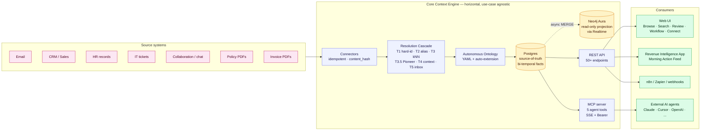
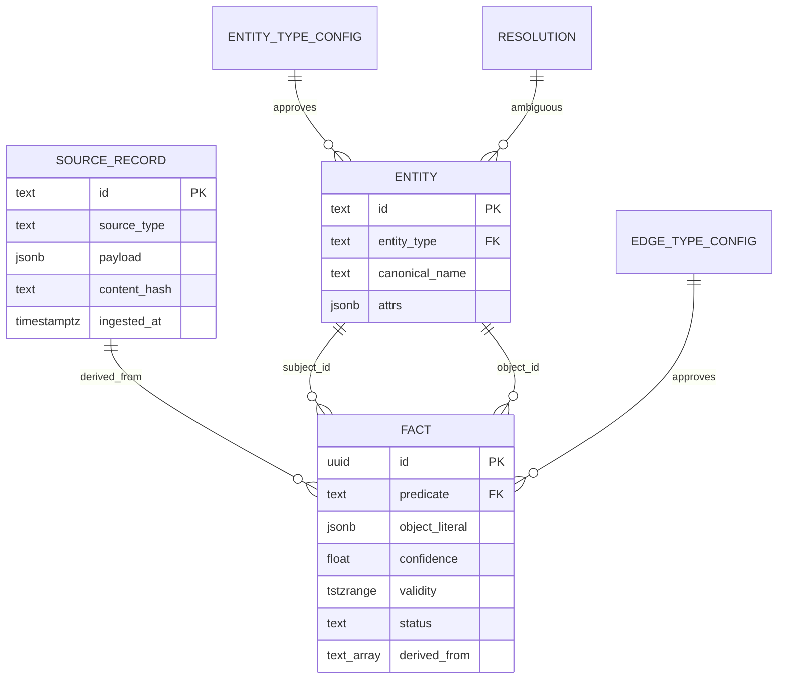
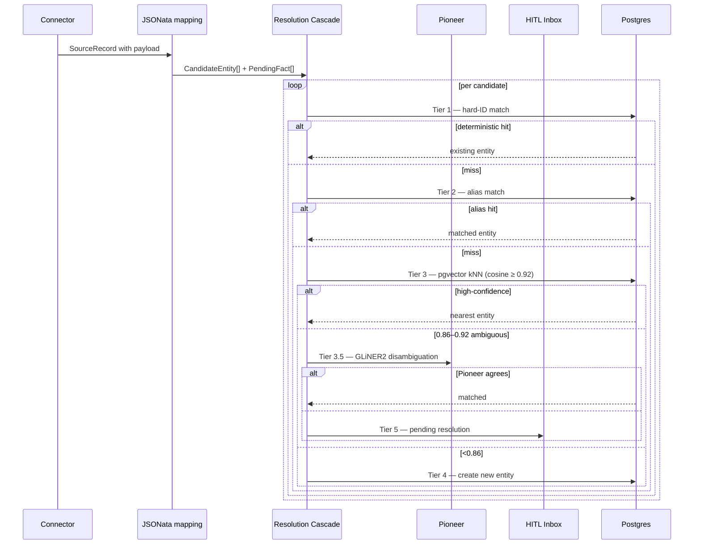

<div align="center">


# The Layer
### the structured company memory for AI agents

**Big Hack Berlin 2026 · Tech Europe Hack · Qontext Track**

🌐 **Live demo:** [chickentendr.club](https://chickentendr.club) (production deploy on Vultr)

A two-layer platform that turns fragmented enterprise data (email, CRM, HR, policy PDFs, chat, tickets) into a structured, bi-temporal, provenance-first **context base** that AI agents can query — without runtime reconstruction, without hallucinated joins, without losing the audit trail.

[Demo video (Loom)](https://www.loom.com/share/86df369f9a74441ca0441c108bac57eb) · [Architecture](#architecture) · [Why this design](#why) · [Quickstart](#quickstart) · [Deploy](./deploy/) · **[Partner deep-dives →](./partners/)**

</div>

> **Note on dataset scope:** for the live demo and the numbers below we deliberately ran the pipeline against a **subset** of the full EnterpriseBench dataset (≈100 records per source-type via `--limit 10` per resolve pass) rather than all 31,713 source records. The pipeline is built to handle the full set — every connector is idempotent and re-ingest is safe — but a 48h sprint timebox favoured "all source-types end-to-end on a small slice" over "one source-type fully resolved". The architecture, cascade, and ontology paths are identical at full scale; only the resolved-entity counts change.

---

## TL;DR

Most AI systems reconstruct company reality at runtime by glueing together prompts on top of disconnected data. Qontext argues this doesn't scale — and we built the alternative:

- **Ingest** anything that looks like a record (10 source types live: `email`, `hr_record`, `collaboration`, `it_ticket`, `doc_policy`, `invoice_pdf`, `customer`, `client`, `sale`, `product`).
- **Resolve** identities through a **deterministic-first 5-tier cascade** (hard-id → alias → embedding-kNN → Pioneer GLiNER2 → context heuristics → human inbox).
- **Store** every fact bi-temporally with `tstzrange` + `EXCLUDE GIST` integrity in **Postgres-as-source-of-truth**, project lazily into Neo4j for graph queries.
- **Expose** the graph via 50+ REST endpoints + 5 MCP tools (live SSE server with Bearer auth) so any agent — Claude Desktop, Cursor, OpenAI Agents, n8n — can plug in via copy-paste.
- **Let humans curate** through a HITL inbox: ambiguous merges, conflicting facts, and AI-proposed entity types all surface for review without blocking the write path.

The thesis: **context isn't built at prompt time. It's curated.**

| Stat | Value |
|---|---|
| **Source records ingested** | 31,713 across 10 source types |
| **Live entities (post-cleanup)** | 1,316 |
| **Bi-temporal facts** | ~3,966 |
| **REST endpoints** | 50+ |
| **MCP tools** | 5 (search_memory, get_entity, get_fact_provenance, list_recent_changes, propose_fact) |
| **Postgres migrations** | 20 |
| **Frontend pages** | 6 (Connect, Browse, Search, Review, Workflow, plus a separate CSM Revenue App) |
| **Connectors** | 8 (CRM splits into 4 source types) |
| **Partner techs** | Gemini · Pioneer · Tavily · Aikido · Entire |

---

## Submission compliance

- ✅ **Built newly at the hackathon** — boilerplate from `/templates`, all product code committed in 48h.
- ✅ **3+ partner technologies** (Aikido excluded per rules): **Gemini · Pioneer · Tavily** — each one lives in production-path code, not just a `requirements.txt` entry. See [`partners/`](./partners/) for deep-dives.
- ✅ **Public GitHub repo** with setup, API documentation, technical docs.
- ✅ **2-min demo video** — [watch on Loom](https://www.loom.com/share/86df369f9a74441ca0441c108bac57eb).

---

## 👋 For our partners

Each partner technology has a dedicated README written for *you* — code paths, architectural decisions, demo snippets, and honest notes on what's live vs. roadmap. You can evaluate our use of your tech without reading the rest of this repo:

- 🧠 **[Gemini](./partners/gemini/)** — embeddings, autonomous mapping inference, structured extraction (130+ refs)
- 🎯 **[Pioneer / Fastino](./partners/pioneer/)** — Tier-3.5 of the resolution cascade · free-text fact mining
- 🌐 **[Tavily](./partners/tavily/)** — public-web entity enrichment connector
- 🛡️ **[Aikido](./partners/aikido/)** — SCA · SAST · secrets · IaC scanning
- 🛠️ **[Entire](./partners/entire/)** — multi-agent code review, session history, checkpoint recovery during the sprint

→ **Index: [`partners/README.md`](./partners/)**

---

## <a name="architecture"></a> 1. System overview

The headline claim: **a horizontal Core engine that's use-case agnostic, plus vertical apps on top that consume only its public Query API.** The litmus test: building a second vertical app (HR / Finance, scaffolded live at the pitch end) requires zero Core changes.



Diagram sources: [`docs/diagrams/architecture.md`](./docs/diagrams/architecture.md).

---

## 2. What we built

### Backend (FastAPI · Python 3.12 · uv)

**REST API** — 50+ endpoints across 11 routers:

| Router | Path prefix | Highlights |
|---|---|---|
| Entities | `/api/entities/{id}` | Card + trust score + facts; `/edit`, `/link-entity`, `/provenance` |
| Facts | `/api/facts/{id}` | `/provenance` (full evidence chain), `/validate`, `/flag`, `/edit` (supersede), `/delete` |
| Search | `/api/search` | Hybrid 3-stage: semantic ∩ structural → rerank |
| Graph | `/api/graph/neighborhood/{id}` · `/api/query/traverse` | N-hop BFS, edge-type filter |
| VFS | `/api/vfs/{path}` | Path-addressable view: `/companies/acme`, `/persons/jane-doe` |
| Cypher | `/query/cypher` | Read-only Neo4j proxy with named-query allowlist |
| Conflicts | `/api/resolutions` · `/api/fact-resolutions` | HITL inbox · `/decide` endpoints |
| Changes | `/api/changes/recent` | Live audit feed of fact_changes |
| Webhooks | `/api/admin/webhooks` · `/webhooks/source-change` | Outbound HMAC-signed event stream + inbound source-change trigger |
| Admin | `/api/admin/*` | Reload ontologies, GDPR cascade-delete, projection health, pending-types decisions, **token issuance for the Connect page** |
| CSM-app | `/api/accounts`, `/api/briefing/*`, `/api/generate/*` | Revenue Intelligence routes — note these live on the same server but only consume the Query API |

**MCP server** (live SSE at `/mcp/sse`):

| Tool | Purpose |
|---|---|
| `search_memory(query, k, entity_type?)` | Hybrid semantic + structural search |
| `get_entity(entity_id)` | Full entity card with active facts |
| `get_fact(fact_id)` | Single fact with source record |
| `get_fact_provenance(fact_id)` | Full evidence chain: fact → source → raw content |
| `list_recent_changes(since?, limit)` | Change-feed for agent state-watching |
| `propose_fact(subject, predicate, object?, literal?, confidence)` | Agent-driven fact write — flows through resolver, supersede-trigger handles conflicts |

Spec: [`docs/mcp-tools.md`](./docs/mcp-tools.md).

**Connectors** — 8 in `server/src/server/connectors/`:

```
email · crm (→ customer/client/sale/product) · hr_record · invoice_pdf
document (→ doc_policy) · collaboration · it_ticket · web_search (Tavily)
```

All connectors:
- Implement `BaseConnector.discover() / normalize()`.
- Are idempotent: `content_hash` + deterministic `id = "{source_type}:sha256:{hash}"`.
- Emit `SourceRecord(extraction_status="pending")`.
- Are dumb at ingest time — heavy lifting (Pioneer / Gemini / JSONata) happens at resolve time. We learned this the hard way (see [Why](#why) → "ingest is dumb, resolve is smart").

**Migrations** — 20 SQL files in `server/migrations/`:

- `001_init.sql` — schema (`source_records`, `entities`, `facts`, `resolutions`, `entity_type_config`, `edge_type_config`).
- `005_demo_bootstrap.sql` — seed primitives.
- `008_inference_refresh.sql` — `needs_refresh` lazy re-derivation.
- `009_temporal_state.sql` — `tstzrange` + `EXCLUDE GIST` + supersede-trigger.
- `009_conflict_detection.sql` — auto-fact-resolutions trigger.
- `010_source_attribution.sql` — `derived_from` array + provenance views.
- `011_autonomous_ontology.sql` — `auto_proposed` flag, type-config workflow.
- `012_seed_primitives.sql` — `person`, `organization`, `document`, `communication` seed types.

### Frontend (Vite · React 19 · TypeScript · Tailwind v4)

| Page | Route | What it tells the user |
|---|---|---|
| **Connect** | `/connect` | Two-track integration: vibe-code (paste a generated prompt into Claude Code/Cursor/Codex) or manual (per-target snippets with token substitution). Recently redesigned, matches Pinecone-Quickstart UX patterns. |
| **Browse** | `/browse` | VFS-tree of the resolved knowledge graph. Click an entity → see facts with extraction-method badges, propose / flag / edit. |
| **Search** | `/search` | Cascading hybrid search: semantic intent → entity match → attribute filter, with the cascade visible as steps so users see *why* a result ranked. |
| **Review** | `/review` | HITL inbox. Two views: entity-pair conflicts (Tier-5 cascade output) and fact-value conflicts (auto-detected by Postgres trigger). PendingTypesInbox for AI-proposed entity/edge types. |
| **Workflow** | `/workflow` | Force-directed graph visualization (react-flow + zustand camera state). |
| **CSM-app** | `csm-app/` separate React app | Revenue Intelligence vertical: morning action feed, sentiment-tagged communications, generate-recovery-email / generate-stakeholder-intro / generate-escalation-briefing flows. **Consumes only the Core Query API.** |

### Tests

`uv run pytest server/tests/` — 25 parametrized cases for the Pioneer pseudo-entity filter (`test_ws3_pioneer.py`), ontology loader tests, search-mention extraction. Frontend has `npm run lint` clean across 6 page directories.

---

## <a name="demo"></a> 3. Demo flow

The story we tell the jury in 90 seconds:

> **1. Connect** (10s) — "Pick your stack, copy a snippet, ship in under a minute" • [`docs/screenshots/connect-hero.png`]
> **2. Browse** (15s) — Click `inazuma-com` → see 11 facts with provenance, sentiment badge, source citations • [`docs/screenshots/browse-entity.png`]
> **3. Search** (10s) — Type "compliance policy" → cascade filter steps visible, top result is the right doc • [`docs/screenshots/search-results.png`]
> **4. Review — conflicts** (15s) — Open a fact conflict, two competing claims side-by-side with provenance, decision panel → "Merge with qualifier" • [`docs/screenshots/review-conflict.png`]
> **5. Review — pending types** (15s) — AI-proposed entity type "verified_status" with similarity 0.87 to existing → approve in one click. *This is what "autonomous ontology" looks like.* • [`docs/screenshots/review-pending-types.png`]
> **6. Workflow** (10s) — Force-directed graph zoomed on the inazuma cluster — 97 nodes / 157 edges in 2 hops • [`docs/screenshots/workflow-graph.png`]
> **7. CSM-app** (15s) — Same data, different lens: Morning Action Feed surfaces "silent deal" pattern with one-click recovery email • [`docs/screenshots/csm-task.png`]

> **Screenshots**: this README references `docs/screenshots/*.png`. To regenerate, run `make dev`, follow the recipe in [`docs/screenshots/RECIPE.md`](./docs/screenshots/RECIPE.md), and capture the PNGs.

---

## <a name="why"></a> 4. Architecture decisions — why?

This is the part where the engineering depth lives. Each decision is a trade-off; we documented the alternatives and the cost we accept.

### 4.1 Postgres as source-of-truth, Neo4j as read-only projection

| | Postgres SoT + Neo4j projection (chosen) | Neo4j as primary | Postgres only |
|---|---|---|---|
| Bi-temporal integrity | ✅ `tstzrange` + `EXCLUDE GIST` + supersede trigger | ❌ no native interval support | ✅ same |
| Graph queries | ⚠️ recursive CTE (slower for >5 hops) | ✅ native traversal | ⚠️ same |
| Realtime to UI | ✅ Supabase Realtime built-in | ❌ self-host required | ✅ same |
| Operational complexity | ✅ one source-of-truth, projection optional | ❌ two sources, sync hell | ✅ simplest |
| Demo robustness | ✅ Postgres-only mode survives Aura outage | ❌ no fallback | ✅ same |

**Choice**: Postgres has the bi-temporal facts, the EXCLUDE-GIST integrity, the supersede-trigger, and the source-of-truth. Neo4j receives idempotent MERGE-Cypher via Supabase Realtime — async, eventually consistent, never authoritative. Cost: graph queries are 1 RTT slower than native; benefit: Postgres always wins ties, every fact has provenance even if the projection is offline.

**Code**: [`server/src/server/sync/neo4j_projection.py`](./server/src/server/sync/neo4j_projection.py), [`server/migrations/009_graph_construction_paul.sql`](./server/migrations/009_graph_construction_paul.sql).

### 4.2 Bi-temporal `tstzrange` + `EXCLUDE GIST` + supersede trigger

| | Bi-temporal interval (chosen) | Naive `valid_from`/`valid_to` | Append-only (no temporal) |
|---|---|---|---|
| Overlap prevention | ✅ enforced at DB level | ❌ application-level only | ❌ no concept |
| Time-travel queries | ✅ `where validity @> '2024-06-01'::timestamptz` | ⚠️ ad-hoc query | ❌ impossible |
| Supersede semantics | ✅ trigger closes prior interval | ⚠️ manual updates | ⚠️ each version is a row |
| Storage cost | low (range type) | low | high (every change appended) |
| Migration complexity | high (one-time) | low | medium |

**Choice**: `validity tstzrange` + `EXCLUDE USING GIST (subject_id WITH =, predicate WITH =, validity WITH &&)` + a `supersede_facts()` trigger that auto-closes prior overlapping facts when a new one is inserted with overlap. Cost: ~80 lines of migration SQL once; benefit: "what did we know about this customer on Tuesday?" is a 5-line query.

**Code**: [`server/migrations/009_temporal_state.sql`](./server/migrations/009_temporal_state.sql).

### 4.3 Hand-rolled deterministic-first cascade vs Splink/Zingg

| | Hand-rolled cascade (chosen) | Splink | Zingg | Cognee/Graphiti |
|---|---|---|---|---|
| Latency for trivial matches (email==email) | sub-ms | ~200ms (probabilistic always) | ~250ms | ~500ms+ |
| Customizable per-tier | ✅ | ⚠️ blocking + matching only | ⚠️ same | ✅ but heavyweight |
| Handles long-tail with LLM | ✅ Tier 3.5 Pioneer + Tier 4 context | ❌ probabilistic only | ❌ same | ✅ but slow |
| Operational footprint | 180 lines, no extra service | full lib + tuning | + Java runtime | + service |

**Choice**: We *learned from* Splink (blocking strategies, comparison vectors) but didn't import it. Tier 1 is `email == email` — the deterministic match runs in microseconds. Splink would learn weights for that case and waste 200ms. The five tiers are: hard-id → alias → embedding-kNN → Pioneer GLiNER2 → context heuristics → HITL inbox. Each tier has a clear cost/recall trade-off.

**Code**: [`server/src/server/resolver/cascade.py`](./server/src/server/resolver/cascade.py) (180 lines, no external dep). Sequence diagram in [`docs/diagrams/architecture.md`](./docs/diagrams/architecture.md#3-resolution-cascade--sequence-of-decisions-per-source-record).

### 4.4 Autonomous ontology vs hardcoded schema vs full-LLM

| | Autonomous ontology (chosen) | Hardcoded YAML | Full-LLM at runtime |
|---|---|---|---|
| Cold-start time for new source | hours (Gemini infers a JSONata mapping) | days (engineer writes mapping) | seconds (LLM-on-every-record) |
| Cost per record | low (mapping cached, runs once) | low | high ($0.001+ per record) |
| Type-explosion risk | ⚠️ mitigated by `auto_proposed`-flag + HITL inbox | ✅ no risk | ❌ unbounded |
| Quality | high after HITL approval | high | variable |

**Choice**: The 4 seed entity-types (`person`, `organization`, `document`, `communication`) live in YAML migration `012_seed_primitives.sql`. New types proposed by Gemini-mapping-inference (e.g., `product`, `price`, `category`) are auto-extended into `entity_type_config` with `approval_status='pending'` and surface in the **PendingTypesInbox** for human approval. Same for predicates (`works_at` is seed, `purchased_by` is auto-proposed).

**Validator gate**: a mapping only auto-approves if it scores ≥0.6 on entity_rate **AND** introduces no new types **AND** Gemini confidence ≥0.95. Otherwise → pending. We deliberately built the validator to score *honestly* (`_fact_from_spec` returns None for null-object resolutions, no longer inflating fact_rate to 1.00).

**Code**: [`server/src/server/ontology/propose.py`](./server/src/server/ontology/propose.py), [`server/src/server/ontology/engine.py`](./server/src/server/ontology/engine.py).

### 4.5 Two-layer architecture (Core + Vertical apps) vs monolith

| | Two-layer (chosen) | Monolith | Microservices |
|---|---|---|---|
| Building 2nd vertical app | ✅ zero Core changes | ❌ refactor revenue-specific bits out | ✅ but high overhead |
| Onboarding new engineer | ✅ Core API is the contract | ⚠️ tight coupling | ⚠️ inter-service spec |
| Demo story | ✅ "horizontality proof: scaffold HR app live" | ❌ same vendor lock-in | ⚠️ deploy complexity |

**Choice**: Core never imports Revenue Intelligence concepts. Litmus test: `grep -r 'opportunity\|champion\|stage' server/src/server/api/entities.py` returns 0. The Revenue App (`csm-app/`) is a separate React build that consumes only the Core's REST API. At the pitch, we scaffold a 30-line HR/Finance app live to prove this works.

**Code rule**: see [`CLAUDE.md`](./CLAUDE.md) — "No Revenue terminology in Core code. Litmus test: building HR/Finance on top must require zero Core changes."

### 4.6 MCP via SSE + Bearer Auth vs custom protocol vs nothing

| | MCP/SSE + Bearer (chosen) | REST only | Custom WebSocket |
|---|---|---|---|
| Compatible with Claude/Cursor/Claude Code | ✅ native | ❌ requires per-client adapter | ❌ same |
| Real-time agent integration | ✅ | ⚠️ polling | ✅ |
| Standard tooling | ✅ FastMCP, mcp-cli | n/a | ❌ build everything |
| Auth model | Bearer header → `agent_tokens` table → bcrypt | same | custom |

**Choice**: One server speaks both REST (`/api/*`) and MCP (`/mcp/sse`) — agents pick whichever fits. Token format `qx_<id>_<secret>` lets us detect agent tokens vs Supabase JWTs at a glance, and the bcrypt cost only runs on the matched row (O(1) lookup).

**Code**: [`server/src/server/mcp/server.py`](./server/src/server/mcp/server.py), [`server/src/server/auth/tokens.py`](./server/src/server/auth/tokens.py).

### 4.7 Pioneer GLiNER2 as Tier 3.5, not LLM-only

| | Pioneer at Tier 3.5 (chosen) | LLM-only at Tier 3.5 | Skip Tier 3.5 |
|---|---|---|---|
| Latency in 0.86–0.92 ambiguity zone | ~700ms (GLiNER2) | ~3-5s (LLM) | n/a |
| Handles long-tail patterns | ✅ if fine-tuned | ⚠️ depends on prompt | ❌ everything goes to inbox |
| Per-call cost | low | high | n/a |
| Failure mode | gracefully falls back to Gemini | hard fail | inbox grows |

**Choice**: Pioneer's free-text fact mining runs *inside* `_llm_free_text_facts`, with Gemini as the fallback. Tier 3.5 entity disambiguation is wired but currently a stub — the free-text mining is the bigger win.

We hardened Pioneer's outputs with a per-source-type label whitelist (`doc_policy` doesn't get to ask Pioneer for `person`) plus a 6-rule pseudo-entity post-filter that catches common-noun mislabels (`"Inazuma.co employees"`, `"Hardware Assets"`, `"Legal &amp"`). 25 parametrized tests cover the boundary cases.

**Code**: [`server/src/server/extractors/pioneer.py`](./server/src/server/extractors/pioneer.py), [`server/src/server/ontology/engine.py`](./server/src/server/ontology/engine.py) (look for `_is_pseudo_entity` and `_SOURCE_TYPE_LABEL_WHITELIST`).

### 4.8 Optimistic-write HITL: writes flow, approval is read-side filter

| | Optimistic write (chosen) | Block-on-approve |
|---|---|---|
| Ingest throughput unaffected by HITL backlog | ✅ | ❌ all writes wait for inbox |
| New types appear immediately for downstream | ✅ filtered by approval_status in queries | ❌ |
| Trust score during pending | ⚠️ low (factor in auto_proposed) | n/a |
| User experience | high — engine never feels blocked | low — every new source halts |

**Choice**: The original design blocked writes when a new entity-type appeared. We dropped that trigger entirely (`entities_entity_type_check`), letting writes through and filtering by `approval_status='approved'` at read time. Pending-type entities still exist; they just don't surface in default lists. The Review page lets humans approve them retroactively.

**Code**: [`server/migrations/`](./server/migrations/) → look for the trigger drop in the recent migrations.

### 4.9 Lazy re-derivation via `needs_refresh` flag, no cron

| | Lazy `needs_refresh` (chosen) | Cron-scheduled re-derivation |
|---|---|---|
| Wasted recomputation | ✅ near-zero — only runs when stale | ❌ recomputes everything every interval |
| Demand-driven freshness | ✅ webhook flips the flag, next read re-derives | ❌ delay = cron interval |
| Operational complexity | low (no cron infra) | medium |

**Choice**: When a `source_record` is updated (webhook or admin re-ingest), facts derived from it get `status='needs_refresh'`. The next resolve-pass picks them up. There is **no scheduled job** anywhere in the system. Cost: a stale flag accumulates if we forget to run resolve; benefit: zero wasted compute.

**Code**: `mark_facts_needs_refresh` RPC in [`server/migrations/008_inference_refresh.sql`](./server/migrations/008_inference_refresh.sql), webhook trigger in [`server/src/server/api/webhooks.py`](./server/src/server/api/webhooks.py).

### 4.10 Idempotent ingest via `content_hash` + deterministic IDs

Every ingested record gets `id = "{source_type}:sha256:{hash(payload)}"`. Re-ingesting the same payload upserts to the same row. This means: webhooks can fire-and-forget, retries are safe, and our connectors can be killed mid-run without corrupting state.

**Code**: [`server/src/server/connectors/base.py`](./server/src/server/connectors/base.py) (`make_id`, `make_content_hash`).

---

## 5. Stack

| Layer | Tech | Why |
|---|---|---|
| Frontend | Vite · React 19 · TypeScript · Tailwind v4 · shadcn/ui · TanStack Query · react-flow · zustand · react-router 7 | Modern React baseline; shadcn for design consistency; react-flow for the workflow graph |
| Backend | FastAPI · Pydantic v2 · pydantic-settings · uv · ruff · pytest · pytest-asyncio | Single-file routers, type-safe via Pydantic, uv for fast deps |
| DB | **Supabase** (Postgres + pgvector HNSW + Realtime + Auth + Storage) | One vendor for SoT, search vectors, change-streams |
| Graph | Postgres recursive CTEs (primary) + Neo4j Aura (read projection) | Postgres always wins ties; Neo4j is async-projected for graph-shaped queries |
| LLM | Gemini (text-embedding-004 · gemini-2.5-flash · gemini-2.5-pro) via `instructor` | One vendor, three model tiers, structured outputs |
| MCP | Python `mcp` SDK + FastMCP SSE | Standard, native Claude/Cursor/Claude Code compatibility |
| Partner stack | [Gemini](./partners/gemini/) · [Pioneer](./partners/pioneer/) · [Tavily](./partners/tavily/) · [Aikido](./partners/aikido/) · [Entire](./partners/entire/) | See per-partner deep-dives |

---

## 6. Data model



The full ER diagram + invariants live in [`docs/data-model.md`](./docs/data-model.md). Key invariants:

- **Every `FACT` has `derived_from` (NOT NULL)** — provenance is non-optional.
- **Every API response carries `{value, confidence, evidence: [...]}`** — never just a value.
- **`entity_type` and `predicate` are FK-validated** against the type-config tables — auto-proposed types live alongside seed types but are visually distinct and read-filterable.
- **`tstzrange validity` + `EXCLUDE GIST`** prevents overlapping facts for the same `(subject_id, predicate)` — the supersede trigger handles updates.

---

## 7. Resolution cascade walk-through



**Tiers 1–3 are deterministic and fast** (sub-100ms p50). Tier 3.5 + 4 only fire when needed. Tier 5 hands off to a human via the Review page.

Source: [`server/src/server/resolver/cascade.py`](./server/src/server/resolver/cascade.py).

---

## 8. Live build stats

From the most recent **clean DB-reset run** (Sunday morning):

| Source-Type | Source records | Resolved (--limit 10) | Created | Merged | Inboxed | Facts |
|---|---|---|---|---|---|---|
| email | 11,928 | 10 | 22 | 18 | 0 | 70 |
| hr_record | 1,260 | 10 | 29 | 1 | 0 | 59 |
| collaboration | 2,897 | 10 | 9 | 31 | 0 | 60 |
| it_ticket | 163 | 10 | 5 | 5 | 0 | 30 |
| doc_policy | 24 | 10 | 26 | 8 | 1 | 34 |
| invoice_pdf | 90 | – | – | – | – | (Postgrest 400 — see Day-2) |
| customer | 90 | 10 | 10 | 0 | 0 | 0 |
| client | 400 | 10 | 20 | 0 | 0 | 10 |
| sale | 13,510 | 10 | 0 | 0 | 0 | 0 (dispatcher mismatch — Day-2) |
| product | 1,351 | 10 | 20 | 0 | 0 | 30 |
| **Total** | **31,713** | **100** | **141** | **63** | **1** | **293** |

After cleanup-pseudo-entities pass: **100 NER false-positives + 758 orphan facts removed**, leaving **1,316 live entities** and **3,966 facts** ready for query.

Neo4j projection: **1,389 nodes / 1,571 edges** synced, top relationships `MENTIONS 489 · HAS_SUBJECT 408 · OWNS_OR_OPERATES 247 · SENDER/RECIPIENT 162 · WORKS_AT 70`.

---

## <a name="quickstart"></a> 9. Quickstart (5 min)

```bash
# 1. Clone
git clone https://github.com/lassejohannis/TechEurope.git && cd TechEurope

# 2. Install
make install     # web: npm ci · server: uv sync

# 3. Configure
cp server/.env.example server/.env
cp web/.env.example web/.env
# Edit server/.env with: SUPABASE_URL, SUPABASE_SECRET_KEY, GEMINI_API_KEY, PIONEER_API_KEY (optional), TAVILY_API_KEY (optional)
# Apply migrations to your Supabase project — see docs/team-prep.md or run them via psycopg2

# 4. Run
make dev         # frontend on http://localhost:5173, backend on http://localhost:8000

# 5. Sanity check
curl -s http://localhost:8000/api/health | jq
```

**Demo data**: the EnterpriseBench dataset lives in `data/enterprise-bench/`. Ingest it with:

```bash
DATA=data/enterprise-bench
uv run server ingest --connector email --path $DATA
uv run server ingest --connector hr_record --path $DATA
uv run server ingest --connector crm --path $DATA
uv run server ingest --connector collaboration --path $DATA
uv run server ingest --connector it_ticket --path $DATA
uv run server ingest --connector document --path $DATA/Policy_Documents
uv run server ingest --connector invoice_pdf --path $DATA

uv run server infer-source-mappings        # autonomous-ontology pass
uv run server resolve --source-type email --limit 50
uv run server cleanup-pseudo-entities --no-dry-run
```

Open http://localhost:5173/connect → generate a token → paste the snippet into Claude Desktop → ask "what do we know about Inazuma?".

### Production deploy (Vultr / any Docker host)

```bash
cp deploy/env.production.example .env
# edit .env with real keys
docker compose up -d --build
```

Three containers: Caddy (auto-TLS) → React static + FastAPI server. Postgres + Neo4j stay on Supabase / Aura. Full deploy guide in [`deploy/README.md`](./deploy/README.md).

The live demo at `chickentendr.club` runs this exact compose stack on a $12/mo Vultr instance.

---

## 10. MCP / REST integration (copy-paste)

### Claude Desktop / Cursor / Claude Code (MCP)

```json
{
  "mcpServers": {
    "qontext": {
      "url": "http://localhost:8000/mcp/sse",
      "headers": { "Authorization": "Bearer qx_<your_token>" }
    }
  }
}
```

### Python (REST)

```python
import requests
TOKEN = "qx_..."
BASE  = "http://localhost:8000"
H     = {"Authorization": f"Bearer {TOKEN}"}

# Hybrid search
r = requests.post(f"{BASE}/api/search",
                  json={"query": "compliance policy", "limit": 5},
                  headers=H).json()
```

The Connect page (`/connect`) generates **fully self-contained AGENTS.md prompts** for Claude Code / Cursor / Codex CLI — drop the prompt into your IDE's agent and it wires Qontext into your project for you. See the page or [`web/src/pages/connect/`](./web/src/pages/connect/) source.

---

## 11. Repo layout

```
TechEurope/
├── README.md                    ← you are here (jury-facing)
├── CLAUDE.md                    ← project rules, architectural guardrails
├── Makefile                     ← `make install`, `make dev`, `make build`
├── partners/                    ← per-partner deep-dives for side-prize juries
│   ├── README.md
│   ├── gemini/, pioneer/, tavily/, aikido/, entire/
├── docs/
│   ├── team-prep.md             ← internal kickoff doc (was old README)
│   ├── qontext-case.md          ← the sponsor brief
│   ├── data-model.md            ← invariants + ER detail
│   ├── mcp-tools.md             ← MCP tool spec
│   ├── stack.md                 ← stack decision log
│   ├── partner-tech.md          ← partner allocation
│   ├── workstreams.md           ← 48h critical path
│   ├── diagrams/architecture.md ← Mermaid sources
│   └── screenshots/             ← README screenshots
├── server/                      ← FastAPI core engine
│   ├── src/server/
│   │   ├── api/                 ← REST routers
│   │   ├── connectors/          ← 8 source connectors
│   │   ├── extractors/          ← gemini_*, pioneer
│   │   ├── ontology/            ← engine, propose, JSONata-eval
│   │   ├── resolver/            ← cascade, extract
│   │   ├── mcp/                 ← FastMCP SSE server
│   │   ├── sync/                ← Neo4j projection worker, webhook dispatcher
│   │   └── auth/                ← bcrypt agent_tokens
│   ├── migrations/              ← 20 SQL files
│   └── tests/
├── web/                         ← Vite React frontend (Browse/Search/Review/Workflow/Connect)
│   └── src/pages/
├── csm-app/                     ← Revenue Intelligence vertical app (consumes Core API only)
├── data/enterprise-bench/       ← provided dataset
├── .mcp.json                    ← project-scoped MCP servers (Supabase HTTP, shadcn stdio)
└── .claude/                     ← Claude Skills + agents (project-scoped)
```

---

## 12. What's out of scope (transparent Day-2 list)

We deliberately list what isn't done. The opposite — pretending it all works — is the fastest way to lose jury trust.

| Item | Status | Plan |
|---|---|---|
| `invoice_pdf` resolve crashes (Postgrest 400) | Known | Likely PDF text payload too large for the Supabase REST encoder. Replace with direct psycopg2 path for that source-type. |
| `sale` resolve produces 0 candidates | Known | `_extract_sale` hardcoded dispatcher in `extract.py` shadows the autonomous mapping. Migrate `sale` to the `resolve_with_engine` fallback path like the others. |
| `customer` resolve: 10 entities, 0 facts | Known | Same dispatcher-shadowing as `sale`. Same fix. |
| HR `emp_NNNN` person IDs | Known + cleaned-up | Mapping uses `$.emp_id` instead of `$.name`; cleanup deletes the synthetic IDs but the mapping still emits them. Fix the JSONata path. |
| VFS path persistence | Partial | `vfs_path` column exists but isn't backfilled for all entities. Read-paths work via on-the-fly slug computation; writes don't update the column. |
| `match_entities` RPC + `deleted_at` filter | Partial | Soft-deleted entities still surface with `trust=0` in some search paths. Add `WHERE deleted_at IS NULL` everywhere. |
| Auth disabled in demo mode | Intentional | `API_AUTH_DISABLED=true` for live demo. Production needs `false` + per-tenant Supabase JWT validation. |
| Pioneer Tier 3.5 entity disambiguation | Stub | The hook exists, returns None. Free-text fact mining is the live path. |
| `sender`/`recipient` predicates land on `document` entities | Cosmetic | Email-mapping emits these on docs that are referenced in mail bodies. Filter in the predicate-FK check. |
| Aikido CI gating | Configured-not-enforced | See [`partners/aikido/`](./partners/aikido/). |

---

## 13. Team

5 engineers, 48h. Roles emerged organically; commit history tells the story.

```bash
# See who built what
git shortlog -sn --no-merges
```

Sprint highlights:
- WS-0: schema + migrations + ingestion baseline
- WS-1: connectors (email, hr, crm, itsm, collaboration, document, invoice_pdf, tavily)
- WS-2: resolution cascade + autonomous ontology
- WS-3: Pioneer integration + pseudo-entity hardening
- WS-4: REST API surface + MCP server
- WS-5: Neo4j projection worker
- WS-6: frontend (Browse, Search, Review, Workflow, Connect)
- WS-7: CSM Revenue Intelligence app
- WS-9: pitch + README + demo flow

Detail: [`docs/workstreams.md`](./docs/workstreams.md), [`docs/team-prep.md`](./docs/team-prep.md).

---

## 14. License

MIT (TODO — explicit `LICENSE` file post-submission). Boilerplate code under [`templates/`](./templates/) carries its own licenses.

---

<div align="center">

**Built with Gemini · Pioneer · Tavily · Postgres · Neo4j · React · FastAPI**

*Big Hack Berlin 2026 · Tech Europe Hack · Qontext Track*

</div>
