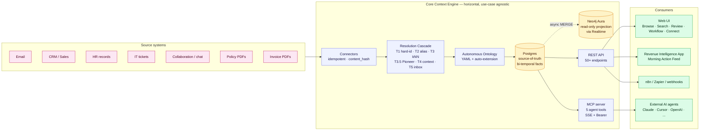
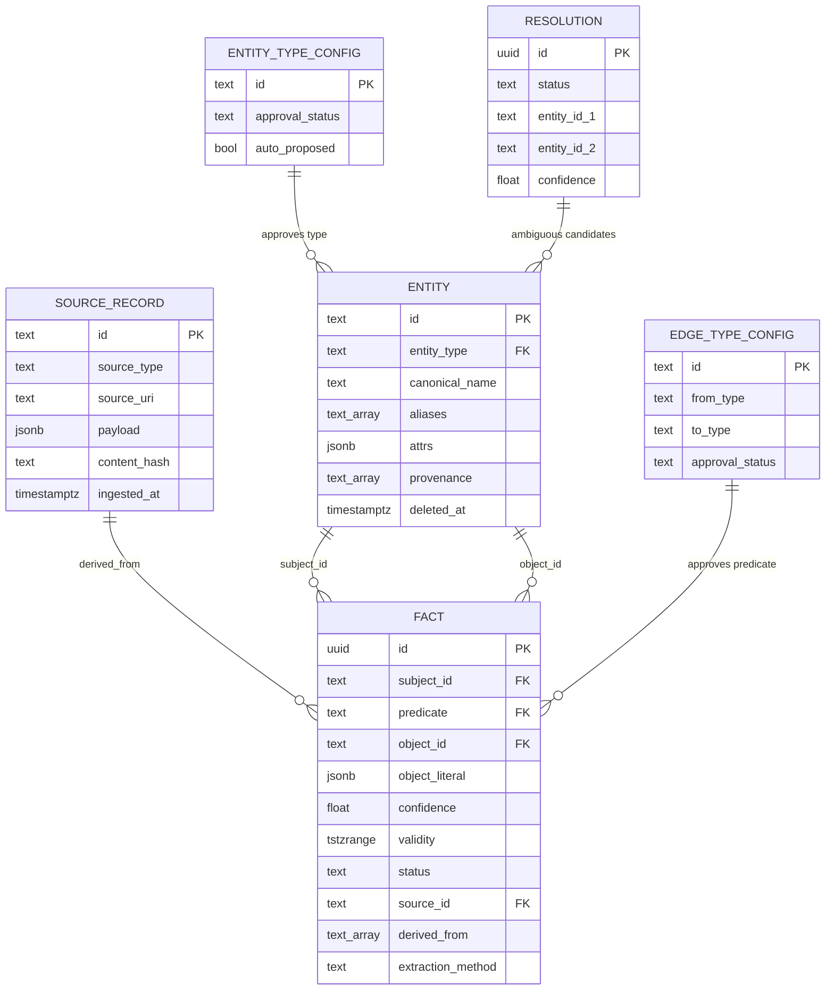
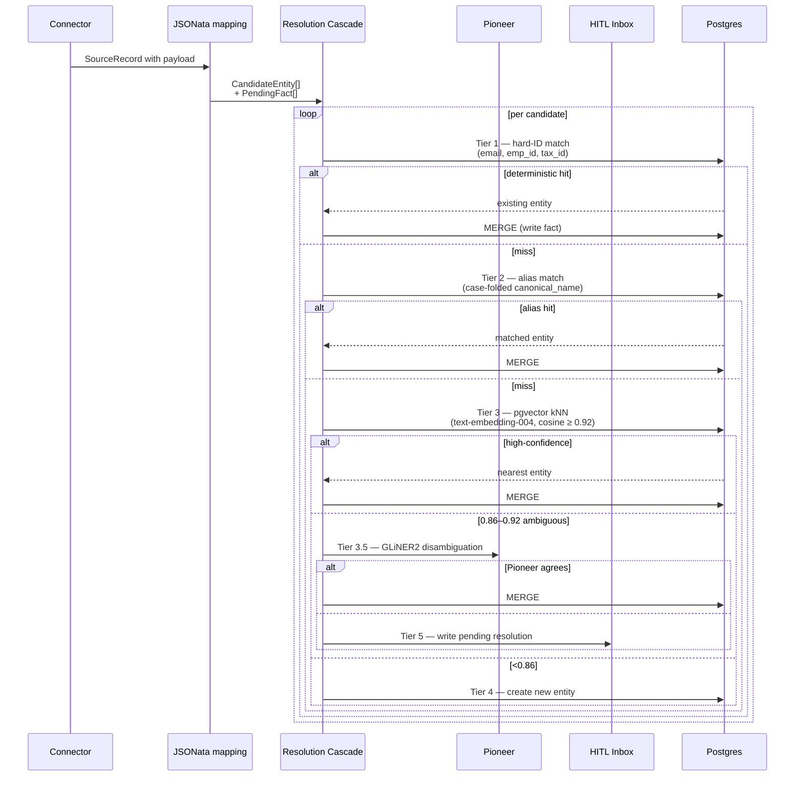
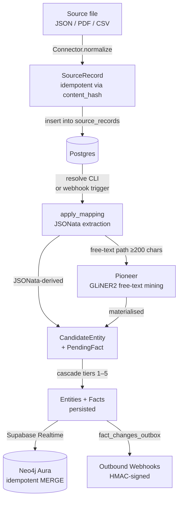

# Architecture diagrams

Mermaid sources for the diagrams embedded in the main [README](../../README.md). Kept here so they are diff-able and editable without scrolling the README.

---

## 1. System overview — two-layer architecture

The horizontal Core never imports vertical-app concepts. Adding a second vertical app (HR, Finance) requires zero Core changes — only a new client of the public Query API.

---

## 2. Data model — what flows through the engine

Every `FACT` carries `derived_from` (NOT NULL invariant). Every API response surfaces `{value, confidence, evidence: [...]}`. **Attribution is non-optional.**

---

## 3. Resolution cascade — sequence of decisions per source record

Tiers 1–3 are deterministic and fast (sub-100ms p50). Tier 3.5 + 4 only fire when needed. Tier 5 hands off to a human.

---

## 4. Ingest → Resolve flow (per source record)

The `resolve` step is **lazy**: it processes whatever sits in `source_records` with `extraction_status='pending'`. There is no cron — re-derivation happens on demand via the `needs_refresh` flag.
