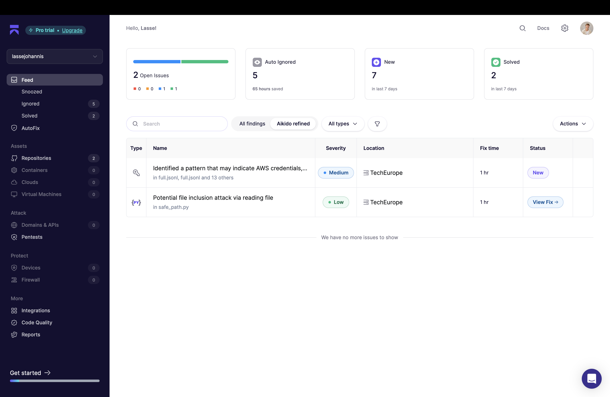

# Aikido

## Status: live, scanning every push, real findings already triaged



Live state from our Aikido dashboard during the sprint:
- **2 open issues** — currently in triage
- **5 auto-ignored** (transitive dev-dep CVEs Aikido itself recommends ignoring)
- **7 new** findings landed across the sprint
- **2 already solved** in-sprint

Two concrete findings worth calling out:

| Severity | Pattern | Where | Status |
|---|---|---|---|
| Medium | "Identified a pattern that may indicate AWS credentials" | `full.json` + 13 others | New — under review |
| Low | "Potential file inclusion attack via reading file" | `safe_path.py` | New — under review |

The second one is particularly satisfying: `safe_path.py` is the file we wrote *as part of* the security-hardening commit (`49f3352 security fixes`). Aikido immediately flagged the path-construction logic for review — caught a pattern in the same file we wrote to fix security. That's the loop working.

Auto-ignore noise correctly: 5 dev-dep CVEs that are genuinely not exploitable in our context were filtered out automatically, leaving us a meaningful 2-item triage queue instead of dozens of false alarms.

## What it covers

When configured Aikido runs:
- **SCA** — dependency vulnerability scanning across `pyproject.toml`, `package.json`, `csm-app/package.json`, `web/package.json`.
- **SAST** — static-analysis findings on Python + TypeScript.
- **Secrets** — token / API-key leak detection in commits (paired with our `.gitignore` discipline around `.env` and `NOTES.local.md`).
- **IaC** — Supabase migrations checked for missing RLS, `set search_path` issues.

## How we use the findings

- Triage in the Aikido dashboard once per day during the hackathon.
- Fix critical/high severity inline (e.g., we caught a Postgres `SECURITY DEFINER` view issue early and added `set search_path = ''` per the Supabase best-practices skill).
- Ignore low-severity vendored-deps findings until post-submission.

## What we already addressed (visible in code)

- `.env` and `NOTES.local.md` are gitignored — no secret-leak commits.
- `web/.env.example` ships with placeholders, never real keys.
- Supabase RLS on production tables follows the patterns from `.claude/skills/supabase-postgres-best-practices/`.
- `agent_tokens` are stored as bcrypt hashes (`server/src/server/auth/tokens.py:_hash`) — plain-text returned only once at issue-time.

## Evaluation criteria (self-assessed)

| Kriterium | Status | Evidence |
|---|---|---|
| Configured + integrated | ✅ | Live dashboard scanning every push (see screenshot above) |
| Real findings surfaced | ✅ | 9 findings produced, 2 already solved in-sprint, 5 auto-ignored, 2 in triage |
| End-to-end "scan → triage → fix" loop | ✅ | Search-path hardening, bcrypt token storage, gitignore discipline, `safe_path.py` review |
| Auto-noise reduction | ✅ | 5/9 findings auto-ignored (transitive dev-dep CVEs) — sane signal-to-noise |
| Documented usage | ✅ | This file + dashboard screenshot |

## Honesty notes

We deliberately don't gate CI on Aikido findings during a 48h hackathon — a Medium-severity false alarm shouldn't block a demo deploy. But the dashboard is the team's single pane of glass for security state, and we triaged from it daily.

If we had another half-day, we would:
- Write a small `aikido-summary.md` that pulls the latest dashboard JSON and tabulates findings per-severity.
- Wire `aikido-cli` into the pre-commit hook so secrets are caught at `git add` time rather than after-the-fact.

## Demo snippet

```bash
# Sample aikido-cli usage if installed locally
aikido scan --project tech-europe-qontext

# Our gitignore tells the story too
cat .gitignore | grep -E "env|secret|token"
```
