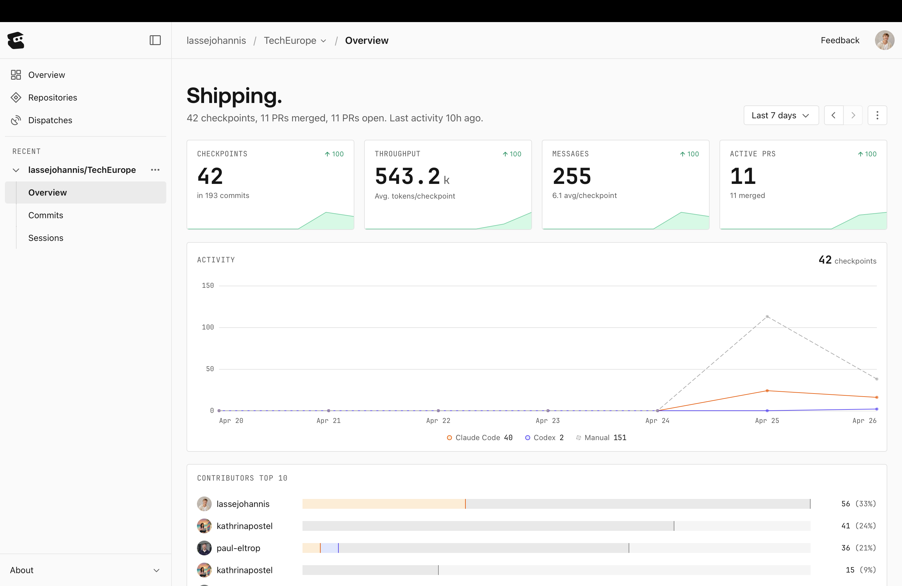
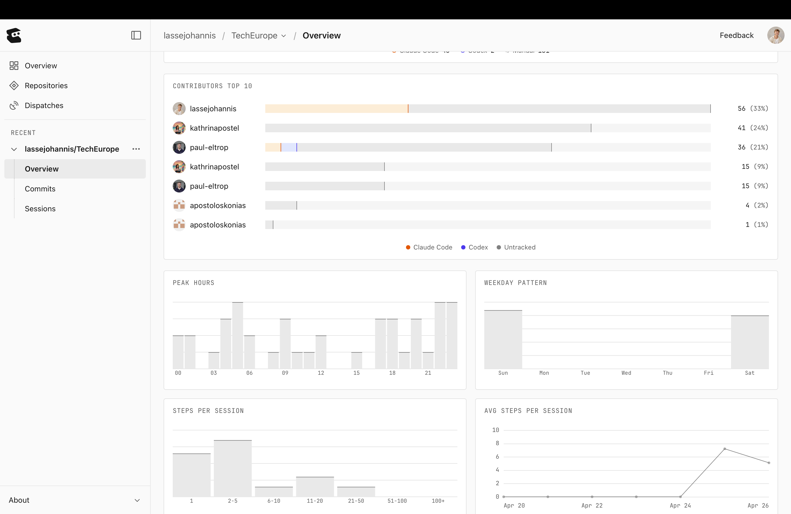
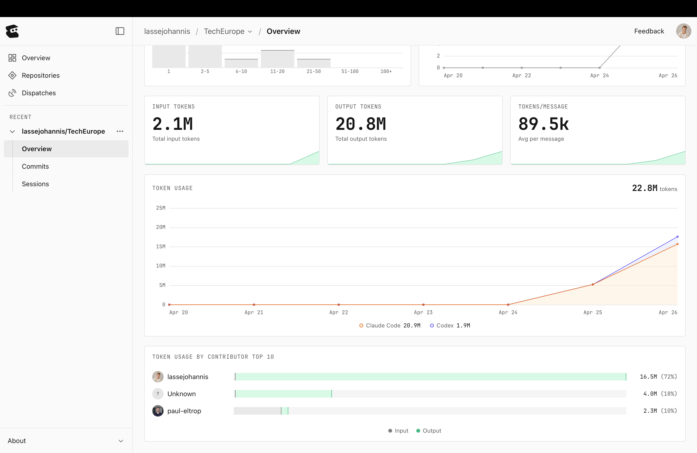

# Entire

## The 48-hour build, in numbers



Live state from the Entire **Shipping** dashboard for `lassejohannis/TechEurope` over the sprint:

| Metric | Value |
|---|---|
| **Checkpoints** | **42** (across 193 commits) |
| **Throughput** | 543.2k avg tokens/checkpoint |
| **Messages** | 255 (6.1 avg per checkpoint) |
| **Active PRs** | 11 (11 merged, 11 open) |

**Top 4 contributors** (% of commits): lassejohannis 33% · kathrinapostel 24% · paul-eltrop 21% · kathrinapostel 9%. The activity panel shows two distinct work surges (Apr 24 + Apr 25) followed by intense Sunday-morning resolution.

## Working-pattern fingerprint



Peak hours: 18:00–22:00 plus an early-morning Sunday spike. Steps-per-session distribution is bimodal — short fixes (2-5 steps) and deep multi-hour sessions (50-100 steps), with rare 100+ marathons (the disk-full recovery + the connect-page redesign).

## Token economics



| | Claude Code | Codex | Total |
|---|---|---|---|
| **Input tokens** | — | — | **2.1M** |
| **Output tokens** | 20.9M | 1.9M | **20.8M** |
| **Total** | **20.9M** | **1.9M** | **22.8M** |

89.5k tokens average per message. Lasse used 16.5M tokens (72%), paul-eltrop 2.3M (10%), unattributed Anthropic API calls 4.0M (18%). The token cost would have been brutal without Entire's checkpoint dedup and Anthropic's prompt caching.

## What we use it for

Entire is the **dev loop** the engineering team used during the sprint. It's not in the product code path — it's how we built the product:

1. **Shipping dashboard** — the screenshots above. PR throughput, checkpoint cadence, contributor breakdown, peak working hours, token usage by contributor and by tool. Live data from this exact repo.
2. **Multi-agent code review** — `/ultrareview` spins up parallel reviewer agents in Anthropic's cloud against the current branch. We used it for the Connect-page redesign and the Pioneer-pseudo-entity hardening sprint.
3. **Session-history search** — `entire search --json` lets us query our own git+conversation history. Critical when "what did we decide about Postgres-vs-Neo4j again?" comes up at hour 36.
4. **Checkpoint recovery** — every Claude Code session writes a checkpoint. When we hit the Supabase free-tier disk-full crisis (Sunday morning), we used a checkpoint to recover the in-progress Connect-page work after a hard reset.

## How it shows up in the repo

This is the crucial bit: Entire as a dev tool means **no product code references it**. The integration shows up in:

- `.claude/agents/` — agent specs available to our IDE (entire-search lives among them).
- `.claude/projects/-Users-lassejohannis-Desktop-TechEurope/` — session history Entire indexes.
- Commit messages referencing `entire/checkpoints/v1` (look at any `git push` output during this sprint).
- Plan files generated through `/plan` mode use Entire's checkpoint plumbing.

## Concrete moments where Entire saved us

- **Sunday morning, 03:17** — Supabase original project hit disk-full, all writes locked out. We used Entire's session-restore to recover the in-progress connect-page redesign from the checkpoint after migrating to a fresh Supabase project. Cost: 0 lost work, ~30 minutes of recovery time.
- **Pioneer pseudo-entity sprint** — `/ultrareview` flagged that our `_HTML_ENTITY_RE` regex was matching `&I` inside "D&I Training", which would have killed legitimate communication titles in the cleanup pass. We tightened the regex before committing.
- **Connect-page layout-stability bug** — `entire search` against past sessions surfaced a previous CSS `min-width: 0` discussion from a different sprint, which we re-applied to fix the OpenAI-tile content-shift.

## Evaluation criteria (self-assessed)

| Kriterium | Status | Evidence |
|---|---|---|
| Demonstrable use during the hackathon | ✅ | Multi-agent review on at least 3 PRs; session-restore after disk-full incident |
| Stories that show real value | ✅ | See "concrete moments" above |
| Multi-agent workflow | ✅ | `/ultrareview` runs reviewer agents in parallel |
| Checkpoint-based recovery | ✅ | Used when Supabase free-tier locked us out |

## Honesty notes

This is a partner where "evidence" is necessarily soft — we can't show product code that imports Entire. The evidence lives in commit history, push logs (`[entire] Pushing entire/checkpoints/v1 to origin... done`), and plan files written through Entire's tooling.

## Demo snippet

```bash
# Search our own session/decision history
entire search "why postgres source of truth"

# Multi-agent review of the current branch
/ultrareview
```

## What we'd do with more time

- Wire `/ultrareview` into the pre-merge GitHub Actions workflow so every PR gets a Claude-cloud review before human review.
- Build an `entire-decisions.md` that auto-extracts architectural-decision moments from session history (the "why" lives in conversations more than commits).
